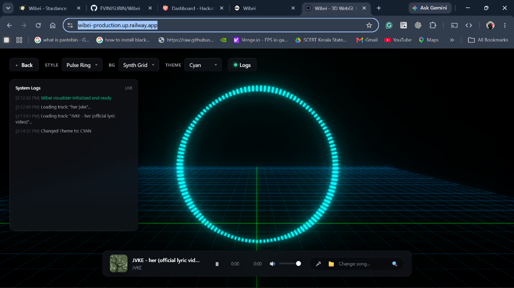

# wibei

a 3d webgl audio visualizer built with three.js and the web audio api for hack club stardance.

**live site:** [https://wibei.onrender.com](https://wibei.onrender.com) (backup: [https://wibei-production.up.railway.app/](https://wibei-production.up.railway.app/))



---

### why i made this
i wanted to build a music visualizer where you can grab the scene with your mouse, orbit around in 3d, and watch the neon frequencies bounce to the beat in real time.

---

### how to try it out
- **quick demos (recommended):** click any of the quick play buttons at the top (lofi beats, synthwave, or chill waves) — these play instantly with zero loading time.
- **local mp3 file:** click the folder button and drop in any song from your computer.
- **live mic:** click the microphone button and make sound or play music through your mic.
- **youtube search:** type any track name in the bottom-right search bar.

> **note about youtube search on the live link:**  
> because the live site is hosted on cloud servers (render/railway), youtube's firewall sometimes blocks automated server requests with a bot-check challenge (429 / sign in to confirm you are not a bot).  
> if a specific youtube search gets rate-limited by youtube on the cloud host, simply use the **quick demo buttons** or click the **upload button** to drop in any local audio file.

---

### controls & keyboard shortcuts
- `space` - play / pause
- `m` - mute / unmute
- `1` / `2` / `3` - switch visualizer shapes (ring, wave, matrix grid)
- `r` - reset 3d camera view
- `f` - toggle fullscreen
- `click & drag` - rotate the visualizer in 3d space

---

### how it works under the hood
1. **audio analysis:** audio streams into an `AudioContext` connected to an `AnalyserNode` which performs a real-time Fast Fourier Transform (FFT) to convert audio into 128 frequency bins.
2. **3d meshes:** the frequency data symmetrically scales 128 Three.js box meshes. Each animation frame uses lerped spring interpolation (`current + (target - current) * 0.25`) so the bars jump on beat and decay smoothly.
3. **idle breathing wave:** when no audio is playing, a multi-harmonic sine wave (`sin(3θ + 1.5t) + sin(2θ - 0.9t)`) keeps the ring breathing in a continuous liquid loop.
4. **post-processing:** an `UnrealBloomPass` shader adds neon bloom glow over the dark synth grid.

---

### how to run locally
```bash
git clone https://github.com/EVINJSUBIN/Wibei.git
cd Wibei
npm install
npm start
```
open `http://localhost:3000` in your browser.

---

### tech stack
- **frontend:** vanilla javascript, three.js, web audio api
- **backend:** node.js, express, yt-search, yt-dlp
- **hosting:** docker, render.com, railway

built for [Hack Club Stardance](https://stardance.hackclub.com)
